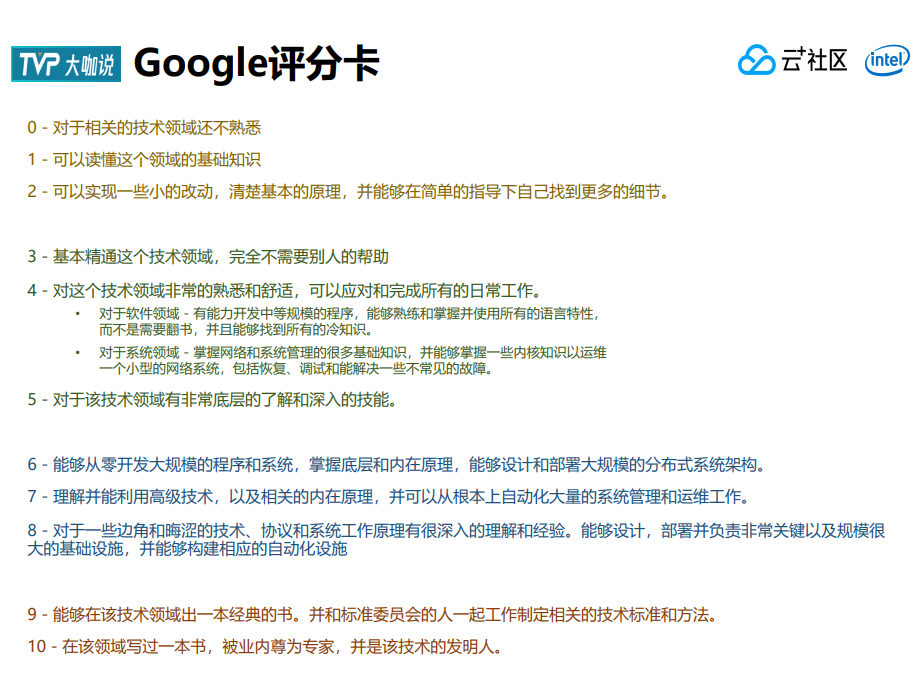

Engineering
----
+ what 软件工程 -- 软件的研发过程的学问
+ why 更有效（软件项目容易失败）、高效（软件工程容易超出预期）、更经济（软件工程容易超出预算）地进行软件研发活动

工程是来自实践的学问，空谈误事，实干出真知。
# Project Manager
项目管理


## 需求管理
需求的来源是什么？合理么？
需求是清晰的么
需求是自洽的么
需求的性价比怎么样？

## 团队管理
怎么算有机组合

成本核算？

如何破解团队整体惰性？

如何破解团队

### 程序员如何分级


+ 基础层：知道怎么用，完成分配任务，并自我练习测试提升，可以不追根究底  
结硬寨，打呆仗
+ 进阶层：了解设计原理和思想，构建技能树和专项能力
+ 精通层：改造设计原理和思想。

### Agile Software Development 敏捷软件开发
Principles Pattern and practices 原则、模式和实践

尽早地、持续地交付可工作的软件的核心目的

## 部署
蓝绿部署/金丝雀升级（灰度升级）/A\B测试

## 可持续性
可持续集成和部署 + 可持续自动化测试（集成测试、性能测试）


# 修习
```
阅读。笔者在朋友圈里调查，60%的人一年看3-5本书，20%的人能看10本左右，15%的人能看20本左右，5%的人能看50-100本书。要超过中位数，一年至少要完整读完10本书，建议内容分散在经济、历史、心理学、方法论、技术等方面，不要偏科。

情绪管理。管理别人要先做好自我情绪管理，太激进的处事风格不利于管理，而且很容易形成压抑的团队气氛，要养成遇事三思的习惯，多方面确认信息的准确性，不要盲目给结论，解决问题的方案多和团队一起商量，避免寡头独裁，一个团队听不到反对的声音非常危险。

健康管理。leader的信息处理量要远大于团队普通员工，互联网行业到最后拼的不是谁比谁年轻，拼的是谁比谁健康。病来如山倒，很多人都知道健康的重要性，但是常常忽略健康的紧急性，总是在处理看起来更紧急的事项，还常常借口"太忙"，其实不是你太忙，是你太“贪婪”，看看互联网这些大佬，不仅钱多，而且身体毛病少。
```