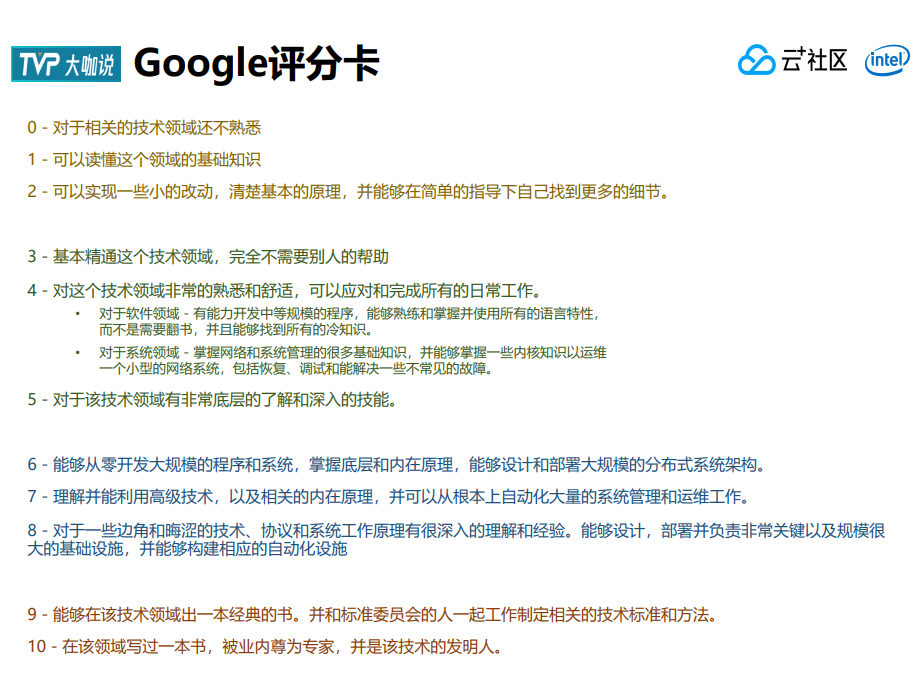

# Project Manager
项目管理

## 需求管理
需求的来源是什么？合理么？
需求是清晰的么
需求是自洽的么
需求的性价比怎么样？

## 团队管理
怎么算有机组合

成本核算？

如何破解团队整体惰性？

### 程序员如何分级

### Agile Software Development 敏捷软件开发
Principles Pattern and practices 原则、模式和实践

尽早地、持续地交付可工作的软件的核心目的

## 部署
蓝绿部署/金丝雀升级（灰度升级）/A\B测试

## CI/CD
