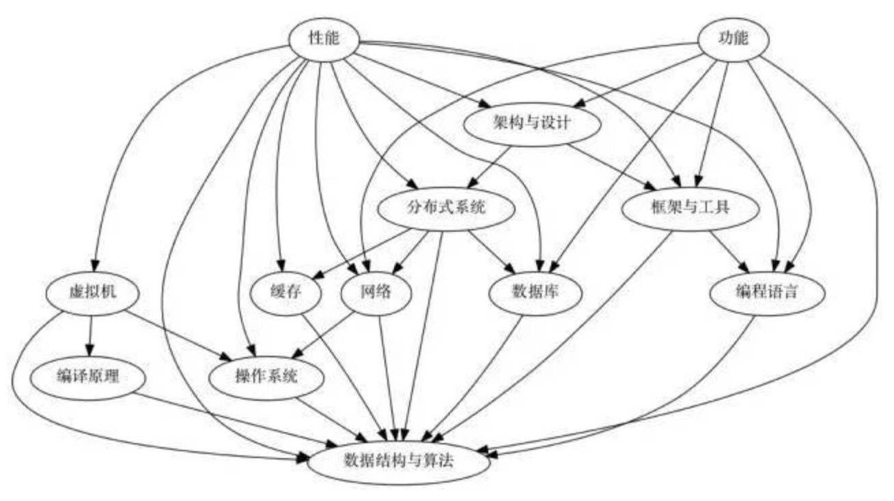

# 概述
此文件夹用于展示、测试一些工作中、学习中遇到的技术点。

## autobuild
自动化编译、构建

## C++
C++相关，std，C++11，boost，lua等

## database
数据库系统相关

## faq
答疑，及各类专题

## libs
精选的第三方库

## linux 
linux操作系统相关

## mid-ware
精选中间件

## otherlang
Python/javascript/Go/Rust 等其他语言

## server-framework
boost-asio/grpc/thrift/gin/beego 等rpc/http框架

## service-mesh
服务网格？服务齿轮？服务咬合？服务档闸？如docker/k8s/云原生 etc

## trouble-shoot