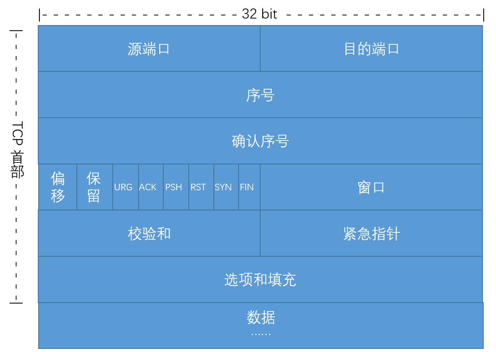
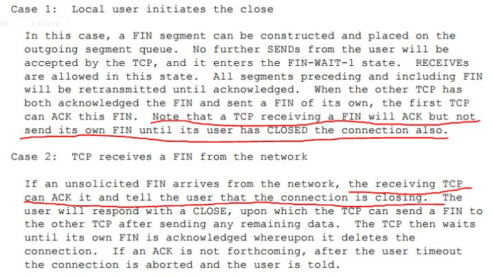

# TCP

## TCP/UDP
TCP是一种面向连接的通讯，使用的是虚电路（与电话通信不同），而UDP是非连接通讯。
前者需要建立连接，保持连接，能够处理断开连接，还要控制流量、控制拥塞。
### 什么是连接，短链接、长连接的区别和优缺点?
+ 面向连接通讯 Connection-oriented communication  
电话通讯和网络通讯中，一种网络通讯模式，在主体数据被传输前，先建立一个通讯会话或者半永久连接，一个流式数据按序发送传输。

+ 非连接通讯connectionless communication  
ip和udp的数据报模式通讯，数据不按序传输，不同的包独立路由，可通过不同的路径。

    + 1.前者网络负责有序发送报文分组并以一种可靠的方式检测丢失和冲突，经常但不完全是可靠的。后者网络只需将报文分组发送到接受点，检错和流控由发送方和接受方处理。

    + 2.前者在两端之间建立了一条数据通信信道，两端保持联系以协调会话和报文分组的接收或失败的信号。这个信道称为虚电路virtual circuit，与物理网络相对。
    
    在有多条到达目的地路径的网络中，物理路径在会话期间会随着数据模式的改变而改变，但是端点和中间节点一直保持对路径的跟踪。虚电路需要一个建立过程，一旦建立，就为长时间的通讯提供一条有效的路径，如大文件传送。后者的设计用于突发的、暂时的通信，用虚电路建立不是很有效。

    + 3.在分组交换远程通信网络中，有些信道永不断连。两点间建立的一条永久信道称为永久虚电路Permanent virtual circuits PVCs，类似电话专线。

    + 4.无连接模式中，接收方必须检测错误并请求重发；如果分组没有按序到达，需要重新排序。
    
    如TCP/ip协议的ip部分。每个数据分组是网络传输的独立单元，称为数据报。两端没有初始协商，发送方仅仅向网络上发送包含源地址和目标地址的数据报。接收方没有分组接收或未接收的应答，也没有流控制，需要对分组重新排序，如果接收到错误的分组则删掉，重新排序时，发现被删掉的包则请求重发。

    + 5.面向连接需要更多的处理来建立和保持连接，但是没有证实有额外开销。

### TCP短链接  
C/S之间一次请求应答操作，一般都是服务器应答后，客户端来断开连接。  
管理起来简单，存在都是有用的连接，不需要额外的控制手段。
### TCP长连接
TCP keepalive功能  
```cpp
s = socket.socket(socket.AF_INET, socket.SOCK_STREAM)
// 开启keepalive
s.setsockopt(socket.SOL_SOCKET, socket.SO_KEEPALIVE, 1)
// 设置每30秒发送一次心跳包，连接空闲时间，默认7200s
s.setsockopt(socket.SOL_TCP, socket.TCP_KEEPIDLE, 30)
// 对方没有回应心跳包后，每隔10秒发送一次心跳包，默认75秒
s.setsockopt(socket.SOL_TCP, socket.TCP_KEEPINTVL, 10)
// 对方3次没有回应心跳包后，即断开连接，默认9次
s.setsockopt(socket.SOL_TCP, socket.TCP_KEEPCNT, 3)
// 一次客户端掉线断开连接探测时间：30+10*3 = 60s
s.connect(('127.0.0.1', 9999)) 
```
保活功能主要为服务器应用提供  
服务器应用希望知道客户主机是否崩溃，从而可以代表客户使用资源。如果客户已经消失，使得服务器上保留一个半开放的连接，而服务器又在等待来自客户端的数据，则服务器将应远等待客户端的数据，保活功能就是试图在服务器端检测到这种半开放的连接。  
在长连接的应用场景下，client端一般不会主动关闭它们之间的连接，Client与server之间的连接如果一直不关闭的话，会存在一个问题，随着客户端连接越来越多，server早晚有扛不住的时候，这时候server端需要采取一些策略，如关闭一些长时间没有读写事件发生的连接，这样可以避免一些恶意连接导致server端服务受损；如果条件再允许就可以以客户端机器为颗粒度，限制每个客户端的最大长连接数，这样可以完全避免某个蛋疼的客户端连累后端服务。

长连接和短连接的产生在于client和server采取的关闭策略，具体的应用场景采用具体的策略，没有十全十美的选择，只有合适的选择。

## TCP报文

+ 源端口，2字节；目的端口，2字节；
+ 序号，4字节；TCP报文使按顺序编号的；
+ 确认号，4字节；期望收到对方下一个报文的序号；
+ 数据偏移，4位；指出TCP报文数据相对TCP首部起始的偏移位置；
+ 保留，6位；值为0
+ URG，1位；URG=1，表明紧急指针字段有效，有紧急数据；
+ ACK，1位；ACK=1，确认号字段有效；  
    TCP规定，连接建立后，所有报文ACK=1
+ PSH，1位；PSH=1，一端的程序希望立即收到响应。
+ RST，1位；RST=1，TCP连接出现异常，必须释放连接，再重新握手；
+ SYN，1位；建立连接时，SYN=1、ACK=0 连接请求；SYN=1、ACK=1 连接同意；
+ FIN，1位；FIN=1，此报文发送方已发送完毕要求释放连接；
+ 窗口，2字节；通知对方，发送方有多大空间来接收；
+ 校验和，2字节；校验首部和数据两部分；
+ 紧急指针，2字节；指向报文中紧急数据的字节数；
+ 选项，长度可变，（首部最长20*32b=80B？），定义其他；

**滑动窗口**  
TCP首部window字段，告诉对方自己能接收多大的数据（对应TCP报文的数据部分），通信双方在建立连接时协商确定，并在通信过程中不断更新，故名滑动窗口。
目的：使发送方控制发数据，发多少数据，即控制流量。也保证通信双方接收缓冲区不会溢出，数据不会丢失（应该是tcp处理得当即可？）。
16位，最大65536B，对于光纤告诉通信，或卫星长连接通讯，使用扩展的32位滑动窗口。

**序列号回绕问题**

## TCP连接建立与断开
TCP协议规定，SYN报文不能携带数据，需要消耗一个序号；
ACK报文可以携带数据，如果不携带，则不消耗序号。

+ 三次握手


+ 四次挥手

内核缺省操作，close函数立即返回，如果发送缓冲区有数据则会把这些数据发送出去。

ESTABLISHED是正在通信，TIME_WAIT是主动关闭，CLOSE_WAIT是被动关闭。

MSL（Maximum Segment Lifetime），最长报文段寿命，一个TCP Segment再网络上可以存活的最大时间。  
RFC793规定（1981年，基于当时的网络情况）MSL为2分钟，对于实际工程来说太长了，TCP允许使用更小的MSL值。  
调低该值，可以使端口等更快空出来给其他连线使用。



**为什么主动断开端，需要等待2MSL** 也即time_wait产生原因

1.保证最后的ACK到达B端，如果B端重发FIN报文，处于TIME_WAIT的A端可以重发ACK（还是发送RST报文，把正常断开的连接当作异常处理？）（并重启MSL定时器，这样看来应该不是为了这个）。 

为了主动断开端（记为A端）发送的最后一个ACK报文段能够到达对端。这个ACK报文段有可能丢失，因而使处在LASK—ACK的对端（记为B端）收不到对已发送的FIN+ACK报文段。B会超时重传这个FIN+ACK报文段，而A就能在2MSL时间内收到这个重传的FIN+ACK报文段。接着A重传一次确认，重新启动2MSL计时器。最后，A和B都正常进入到CLOSED状态。如果A在TIME_WAIT状态不等待一段时间，而是在发送完ACK确认后立即释放连接，那么就无法收到B重传的FIN+ACK报文段，因而也不会再发送一次确认报文段，这样，B就无法正常进入CLOSED状态（超时时间后释放资源，超时时间是？）。

2.TIME_WAIT期间，A端非FIN报文将被忽略，且不会发送非ACK报文，避免新连接（复用当前连接）中出现的旧连接的请求连接报文。  

假如A发送一个请求连接报文段丢失而未收到确认，A就会重传一次连接请求，后来B收到了确认，建立了连接。数据传输完毕后，就释放了连接。A共发送了两个连接请求报文段，其中第一个丢失，第二个到达了B。假如现在A发送的第一个连接请求报文段没有丢失，而是在某些网络节点长时间都留了，以至于延误到连接释放后的某个时间才到达B，这本来是已失效的报文段，但B并不知道，就会又建立一次连接。而等待的这2MSL就是为了解决这个问题的，A在发送完最后一个确认报后，在经过时间2MSL，就可以使本链接持续时间内所产生的所有报文段都从网络中消失，这样就可以使下一个新的连接中不会出现这种旧的连接请求报文段。

回到MSL，在2MSL时间内，该地址上的连接（客户端地址，端口和服务器的端口地址）不能被使用，比如我们在建立一个连接后关闭连接然后迅速重启连接，那么就会出现端口不可用的情况。

**大量time_wait产生原因**
```sh
netstat -n |awk '/^tcp/ {++S[$NF]} END {for(a in S) print a, S[a]}'
## 输出
## CLOSE_WAIT 2
## ESTABLISHED 2
## FIN_WAIT2 1
```
服务停止后立即重启，新套接字依旧适用同一五元组sock，导致大量TIME_WAIT状态。  

早期的HTTP 1.0/1.1服务器因为是大量tcp短链接，服务端主动关闭连接，请求量很大的时候，会有大量TIME_WAIT。
比如server每秒1k请求，就会积压240*1000=240000个，远超端口数，和OS打开句柄数限制。
HTTP 1.1规定默认KeepAlive，也就是会重用TCP连接传输多个req/res，主要就是因为这个。

TIME_WATI状态过多，端口资源被耗尽（非内存资源被耗尽或五元组被占用），报错（cannot assign requested address）。
（虽然五元组是唯一，但是每一个连接都需要使用一个端口号，实际可以利用五元组唯一，仅使用一个端口吧？）

处理办法  
设置SO_REUSEADDR，使内核判定当端口忙，但TCP连接处于TIME_WATI状态时，五元组sock可重用。
1.使用socket池化技术，服务重启，socket连接不关闭。
2.setsockopt函数socket选项SO_LINGER，异常终止连接发送RST，不进入四次挥手(SO_LINGER会使close()“优雅”关闭，阻塞当前线程)。

或者修改内核，优化TIME_WAIT相关的配置，比如MSL时长？

端口资源耗尽  
应从源头入手，定期清理不活跃连接；留足充分的端口空间；多IP同时提供服务；
```sh
#对于一个新建连接，内核要发送多少个 SYN 连接请求才决定放弃,不应该大于255，默认值是5，对应于180秒左右时间 
net.ipv4.tcp_syn_retries=2
#net.ipv4.tcp_synack_retries=2
#表示当keepalive起用的时候，TCP发送keepalive消息的频度。缺省是2小时，改为300秒
net.ipv4.tcp_keepalive_time=1200
net.ipv4.tcp_orphan_retries=3
#表示如果套接字由本端要求关闭，这个参数决定了它保持在FIN-WAIT-2状态的时间
net.ipv4.tcp_fin_timeout=30  
#表示SYN队列的长度，默认为1024，加大队列长度为8192，可以容纳更多等待连接的网络连接数。
net.ipv4.tcp_max_syn_backlog = 4096
#表示开启SYN Cookies。当出现SYN等待队列溢出时，启用cookies来处理，可防范少量SYN攻击，默认为0，表示关闭
net.ipv4.tcp_syncookies = 1

#表示开启重用。允许将TIME-WAIT sockets重新用于新的TCP连接，默认为0，表示关闭
net.ipv4.tcp_tw_reuse = 1
#表示开启TCP连接中TIME-WAIT sockets的快速回收，默认为0，表示关闭
net.ipv4.tcp_tw_recycle = 1

##减少超时前的探测次数 
net.ipv4.tcp_keepalive_probes=5 
##优化网络设备接收队列 
net.core.netdev_max_backlog=3000 
```
**大量close_wait产生原因**  
如果是一个爬虫服务器，爬取网络上各web服务，获得数据后被对端异常断开连接，就会产生大量close_wait。
close_wait可以通过修改业务层代码解决。


**为什么握手三次，挥手四次？**  
两次握手达不到让双方都得出自己、对方的接收、发送能力都正常的结论。四次握手多余。  

TCP是全双工的通讯，三次挥手做不到双方应用层控制主动关闭写（如果场景确定，也可以三次挥手）。  
如果A端断开连接的FIN包到达B端同时，B端也主动断开连接，TCP可以把B端的FIN包和给A端的ACK包组合在一起发给A端，不用放在两个包。

**TCP连接端口号怎么应对多个连接**
+ 程序在listen某个端口，即独占该端口
+ socket端口是虚拟的，不是物理的
+ 一个Socket连接的主键（accepet函数返回的连接，即不同socket之间的区分）是由一个五元组{SRC-IP, SRC-PORT, DEST-IP, DEST-PORT, PROTOCOL}组成，即{源地址，源端口，目标地址，目标端口，协议}组成
+ 一个进程可以拥有多个socket连接

==>

+ 同主机不同（或相同）进程可以不同协议可以监听同一个端口
+ 某个协议的进程可以监听多个客户端的连接，因为只要五元组不同进程就能分辨
+ 客户端同个进程也可以在同个端口用不同的协议与客户端建立连接

**connect函数成功，是否占用一个端口号？**  
应该不会，应该是按五元组判定唯一
connect函数是否可以使用同一个端口号，来连接多个服务？（实际是随机使用一个端口号）connect使用端口号的机制是怎样的？

**已建立连接，客户端突然故障，会怎样？**  
TCP设有一个保活计时器。服务端每收到一次客户端请求后，都会重置这个计时器，时间通常为2小时，若2小时未收到客户端数据，服务器间隔75秒发送一次探测报文，一共9次。如果客户端一直没有应答，则服务器端判定客户端异常，然后关闭连接。（socket函数recv/send返回-1，errno=ETIMEDOUT）

如果客户端重启后，接收到服务器端的探测报文，会向服务器端发送RST报文，服务器端socket函数返回-1，errno=ECONNRESET。

如果是客户端运行正常，服务器不可达，socket函数返回-1，errno=EHOSTUNREACH/ENETUNREACH；如果服务器可达，但是端口没有被程序监听，则被发送一个RST报文，向应用层返回errno=ECONNREFUSED

**syn flood攻击**  
最基本的DoS攻击就是利用合理的服务请求来占用过多的服务资源，从而使合法用户无法得到服务的响应。syn flood属于Dos攻击的一种。

如果恶意的向某个服务器端口发送大量的SYN包，则可以使服务器打开大量的半开连接，分配TCB（Transmission Control Block）, 从而消耗大量的服务器资源，同时也使得正常的连接请求无法被相应。当开放了一个TCP端口后，该端口就处于Listening状态，不停地监视发到该端口的Syn报文，一 旦接收到Client发来的Syn报文，就需要为该请求分配一个TCB，通常一个TCB至少需要280个字节，在某些操作系统中TCB甚至需要1300个字节，并返回一个SYN ACK命令，立即转为SYN-RECEIVED即半开连接状态。系统会为此耗尽资源。

**tcp超时定时器**  
保活定时器、SYN-ACK重传定时器、FIN_WAIT2定时器是共用一个定时器实例sk->sk_timer，它们的超时处理函数也是一样的，都为tcp_keepalive_timer()。

**内核里TCP的SYN队列和accept队列管理**

### send() 函数
返回值
+ EACCES  
针对Unix Domain Socket，没有权限访问
+ EAGAIN/EWOULDBLOCK  
socket设置了非阻塞，但此时send需要等待（业务层应该稍后重试）
EAGAIN对于InternetDomainDatagramSocket，有种情况是分配端口地址失败？
+ ECONNRESET  
对端重置，此端收到RST包
+ EPIPE  
（特指TCP）此端已被关闭
+ 其他
socket参数/内存不够/sockfd非法等等

### recv() 函数
recv()，返回0，对方请求释放连接；
返回-1，连接异常；
返回n，读取了长度为n的数据；

## TCP通信怎么控制流量
+ 流量控制  
如果发送者发送数据过快，接收者来不及接收，那么就会有分组丢失。为了避免分组丢失，控制发送者的发送速度，使得接收者来得及接收，这就是流量控制。
     流量控制引发的死锁？怎么避免死锁的发生？
+ 拥塞控制
    + 慢开始算法  
    先探测网络，记录拥塞窗口（cwnd，congestion window，标识网络拥塞程度），发送方把发送窗口等于拥塞窗口（实际在拥塞窗口和接收方窗口选小值）。
    + 拥塞避免  
    经过一个RTT（往返时间，或者传输回合），拥塞窗口加倍。拥塞（没按时收到确认），则发送窗口减半。
    + 快重传算法  
    接收方收到失序报文，不等自己发送数据捎带，而是立马发送重复确认。发送方收到后，立马重传。
    + 快恢复算法  
    发送发收到三个重复确认，发送窗口减半，不执行满开始算法，而是拥塞避免。

### 滑动窗口协议
+ 发送方和接收方分别具有当前序列号nt和nr和一个窗口大小wt和wr。  
窗口大小可能会根据网络流量的变化而有所不同。窗口大小必须大于零才能进行任何操作。操作后，序号发生变化。
+ 当发送方具有要发送的数据时，它可以传输序列号在最新的确认na后的wt个数据包  
指定时间内收到其确认，或者重传。
+ 每次接收到一个编号为x的数据包时，接收方检查它是否落入接收窗口  
是则接受，并发送确认（捎带）；否则丢弃，并发送重复确认（立马）

## TCP怎么保证有序
+ 发送方发送数据时，TCP就给每个数据包分配一个序列号  
在一个特定的时间内等待接收主机对分配的这个序列号进行确认，如果发送主机在一个特定时间内没有收到接收主机的确认，则发送主机会重传此数据包：   
    + 为了保证数据包的可靠传递，发送方必须把已发送的数据包保留在缓冲区，并为每个已发送的数据包启动一个超时定时器；  
    + 如在定时器超时之前收到了对方发来的应答信息（可能是对本包的应答，也可以是对本包后续包的应答），则释放该数据包占用的缓冲区;  
    + 否则，重传该数据包，直到收到应答或重传次数超过规定的最大次数为止。
+ 接收主机利用序列号对接收的数据进行确认  
检测对方发送的数据是否有丢失或者乱序等，接收主机一旦收到已经顺序化的数据，它就将这些数据按正确的顺序重组成数据流并传递到高层进行处理  
接收方收到数据包后，先进行CRC校验，如果正确则把数据交给上层协议，然后给发送方发送一个累计应答包，表明该数据已收到，如果接收方正好也有数据要发给发送方，应答包也可方在数据包中捎带过去。

## Nagle算法
TCP为提高效率，发送方要收集到足够的数据才会发送，或者小包打包成大包再发送，或者超时发送。

## TCP粘包问题
TCP是一个基于字节流的传输服务，"流"意味着TCP所传输的数据是没有结束的（除非连接断开）。这不同于UDP提供基于消息的传输服务，其传输的数据是有结束的。应用层需要自己判断处理从recv()读取的数据（TCP层接收到的，放在缓冲区的数据），拼接成是一个个完整的数据包。应用层没处理好，就会出现部分包的数据确实或错乱的现象，就是粘包问题。

比如，A端发送不定长数据多次，B端使用定长缓存读取，假如A端的两个或多个包同时到达，或者B端处理的慢，一次读取了定长缓存里包含一个包的一部分或一个完整的包和另一个包的一部分，且没能处理不完整的包。

或者是A端的问题，发送了不合法的数据，命名头部指示长度为n，实际写入长度却小于n，导致B端接收错误。

+ 发送定长包  
如果每个消息的大小都是一样的，那么在接收对等方只要累计接收数据，直到数据等于一个定长的数值就将它作为一个消息。
+ 包尾加上\r\n标记  
FTP协议正是这么做的。但问题在于如果数据正文中也含有\r\n，则会误判为消息的边界。
+ 包头加上包体长度  
包头是定长的4个字节，说明了包体的长度。接收对等方先接收包体长度，依据包体长度来接收包体。
+ 使用复杂的应用层协议。

粘包问题是应用层没有处理好流，与TCP无关，现在已经有成熟的应用层协议如http、protobuff等处理TCP流（常常是包头记录长度，包尾/r/n；定长的包局限性较大）。

服务端如何做到健壮，对于非法的客户端数据判断并处理，不影响正常的服务。
