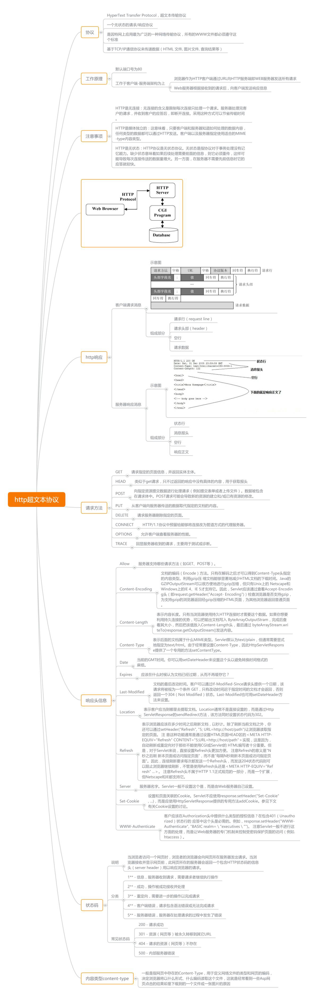

# HTTP

## GET和POST区别
简单地说，非Ajax api，GET用于获取一个资源（可以是html/css/图片/js代码等等）；POST用于提交表单form，并返回结果（可以是个网页？）。
GET应具有幂等性，即不对数据有副作用；GET的数据可以被缓存在浏览器端/代理nginx/server端Etag等等。  
浏览器的GET只能由url触发，所以GET只能在url中querystrig带参数，没有body，HTTP并无这个限制。  
POST不幂等，不能执行多次，不能缓存，不能保存成书签。  
POST的请求数据在body中，HTTP并没限制POST不能在querystring带参数  
以上都是约定，具体实现最好按约定来。

Ajax api，或App http客户端，httpclient，curl，postman的GET和POST请求不止用于前后端交互，还用在后端的各服务的调用，当作RPC服务调用，并没有浏览器那么多限制，只需符合HTTP格式。

两者安全性依赖HTTP的明文协议，都不够安全。最好用HTTPS

GET后退按钮/刷新无害，POST数据会被重新提交（浏览器应该告知用户数据会被重新提交）。GET书签可收藏，POST为书签不可收藏。GET能被缓存，POST不能缓存 。GET编码类型application/x-www-form-url，POST编码类型encodedapplication/x-www-form-urlencoded 或 multipart/form-data。为二进制数据使用多重编码。GET历史参数保留在浏览器历史中。POST参数不会保存在浏览器历史中。GET对数据长度有限制，当发送数据时，GET 方法向 URL 添加数据；URL 的长度是受限制的（URL 的最大长度是 2048 个字符）。POST无限制。GET只允许 ASCII 字符。POST没有限制。也允许二进制数据。与 POST 相比，GET 的安全性较差，因为所发送的数据是 URL 的一部分。在发送密码或其他敏感信息时绝不要使用 GET ！POST 比 GET 更安全，因为参数不会被保存在浏览器历史或 web 服务器日志中。GET的数据在 URL 中对所有人都是可见的。POST的数据不会显示在 URL 中。

GET和POST还有一个重大区别?(实际可能是有无body的区别，和GET / POST无关 )简单的说：GET产生一个TCP数据包；POST产生两个TCP数据包。对于GET方式的请求，浏览器会把http header和data一并发送出去，服务器响应200（返回数据）； 而对于POST，浏览器先发送header，服务器响应100 continue（HTTP并未证实，GET不能这样，或POST必须这样），浏览器再发送data，服务器响应200 ok（返回数据）。

GET的语义是请求获取指定的资源。GET方法是安全、幂等、可缓存的（除非有 Cache-ControlHeader的约束）,GET方法的报文主体没有任何语义。POST的语义是根据请求负荷（报文主体）对指定的资源做出处理，具体的处理方式视资源类型而不同。POST不安全，不幂等，（大部分实现）不可缓存。为了针对其不可缓存性，有一系列的方法来进行优化，以后有机会再研究（FLAG已经立起）。还是举一个通俗栗子吧，在微博这个场景里，GET的语义会被用在「看看我的Timeline上最新的20条微博」这样的场景，而POST的语义会被用在「发微博、评论、点赞」这样的场景中。

GET/POST是语义之别，非语法之别。

## 1.https的实现和区别
http协议传输的数据都是未加密的，也就是明文的，非常不安全。
网景公司设计SSL（SecureSocketLayer）协议用于HTTP协议传输数据加密，诞生了https，比较安全。
+ 1.https协议需要用到ca申请证书，免费的少，需要一定费用
+ 2.https具有安全性的ssl加密了http的超文本明文传输
+ 3.https使用了完全不同的连接方式，用的端口也不一样，https443，http80
+ 4.http简单无状态的，https可进行加密传输、身份认证的网络协议

#### 1. 客户端发起HTTPS请求
　　这个没什么好说的，就是用户在浏览器里输入一个https网址，然后连接到server的443端口。
#### 2. 服务端的配置
　　采用HTTPS协议的服务器必须要有一套数字证书，可以自己制作，也可以向组织申请。区别就是自己颁发的证书需要客户端验证通过，才可以继续访问，而使用受信任的公司申请的证书则不会弹出提示页面(startssl就是个不错的选择，有1年的免费服务)。这套证书其实就是一对公钥和私钥。如果对公钥和私钥不太理解，可以想象成一把钥匙和一个锁头，只是全世界只有你一个人有这把钥匙，你可以把锁头给别人，别人可以用这个锁把重要的东西锁起来，然后发给你，因为只有你一个人有这把钥匙，所以只有你才能看到被这把锁锁起来的东西。
#### 3. 传送证书
　　这个证书其实就是公钥，只是包含了很多信息，如证书的颁发机构，过期时间等等。
#### 4. 客户端解析证书
　　这部分工作是有客户端的TLS来完成的，首先会验证公钥是否有效，比如颁发机构，过期时间等等，如果发现异常，则会弹出一个警告框，提示证书存在问题。如果证书没有问题，那么就生成一个随机值。然后用证书对该随机值进行加密。就好像上面说的，把随机值用锁头锁起来，这样除非有钥匙，不然看不到被锁住的内容。
#### 5. 传送加密信息
　　这部分传送的是用证书加密后的随机值，目的就是让服务端得到这个随机值，以后客户端和服务端的通信就可以通过这个随机值来进行加密解密了。
#### 6. 服务段解密信息
　　服务端用私钥解密后，得到了客户端传过来的随机值(私钥)，然后把内容通过该值进行对称加密。所谓对称加密就是，将信息和私钥通过某种算法混合在一起，这样除非知道私钥，不然无法获取内容，而正好客户端和服务端都知道这个私钥，所以只要加密算法够彪悍，私钥够复杂，数据就够安全。
#### 7. 传输加密后的信息
　　这部分信息是服务段用私钥加密后的信息，可以在客户端被还原。
#### 8. 客户端解密信息
　　客户端用之前生成的私钥解密服务段传过来的信息，于是获取了解密后的内容。整个过程第三方即使监听到了数据，也束手无策。

### 长连接和短连接
+ 长连接多用于频繁读写，如数据库连接，需要心跳保活
+ 短连接多用于web网站http服务，用户不会频繁操作，不需要保活

在HTTP/1.0中，默认使用短连接。从HTTP/1.1起，默认使用长连接，在响应头加入这行：Connection:keep-alive。Keep-Alive不会永久保持连接，它有一个保持时间，可以在不同的服务中设置。需要服务端/客户端都支持。  
HTTP是个无状态的面向连接的协议。什么是有状态的呢？无状态不代表HTTP不能保持TCP连接，更不能代表HTTP使用的是UDP协议。实质上是TCP的长连接和短连接。  

**保活功能**  
如果client一直不关闭连接，server早晚有抗不住的时候，这时候server需要采用一些策略，如主动关闭一些长时间没有读写时间复生的连接，以避免一些恶意连接导致server端崩溃。如果条件允许，可以以客户端机器为颗粒度，限制每个客户端的长连接数量，避免某个客户端拖累整个服务。  
短连接较为简单，不需额外的控制手段，如客户请求频繁，将在TCP的连接操作上浪费时间和带宽。所以，长短连接本质是client和server采取的策略不同。没有十全十美的选择。

### 推送技术 反向AJAX，相对的是拉取

