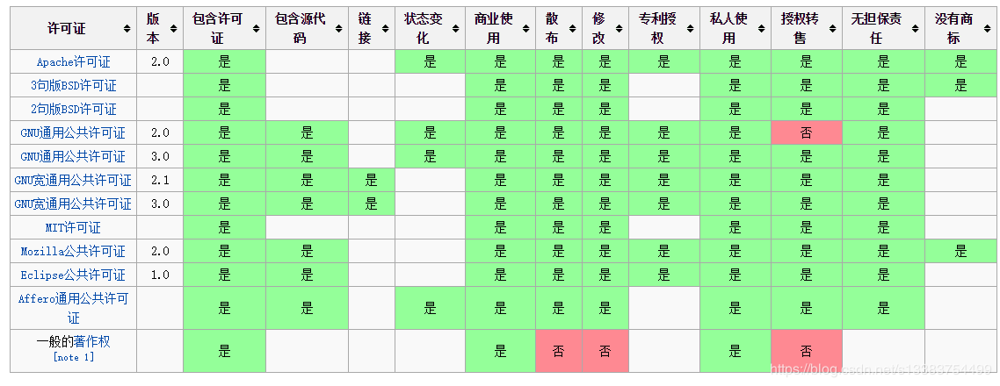

# 许可证 License
著作权/Copyright

## 基本概念
+ 贡献者 Contributors，初始贡献者Initial Contributor，后续贡献者 Subsequent Contributor
+ 受益者 Recipients，代码或项目获取者，后续贡献者也是受益者
+ 源码 Source Code，源代码，包括文档
+ 类库 Object Code，需要编译的代码编译后的文件或不需要编译的源代码
+ 衍生模块 Derivative Module，基于最初源代码的增强、改善、延续的模块
+ 独立模块 Separate Module，参考或借助源代码，开发出的独立的、不包含、不依赖源代码模块的代码模块
+ 开源代码促进协会 Open Source Initiative，OSI，1998，官网opensource.org，旨在推动、促进源码软件的发展。

常见开源License有：BSD/Apache/GPL/LGPL/MIT/MPL都是OSI批准的，有着不同的约束，如果要开源自己的代码，最好选择一个开源License。

## 权限

+ 他人可以拿去闭源
  + 每一个修改过的文件必须放置版权说明
    + Apache
  + 不用放置版权说明
    + 衍生软件可以使用来源促销
      + MIT
    + 不可以使用来源促销
      + BSD
+ 不可拿去闭源
  + 新增代码采用同样许可证
    + GPL
  + 新增代码不用采用同样许可证
    + 对源码的修改之处需提供说明文档
      + Mozila
    + 不用对修改支持说明文档
      + LGPL

github添加LICENSE  
项目下添加LICENSE文件，即可为自己的项目添加许可证