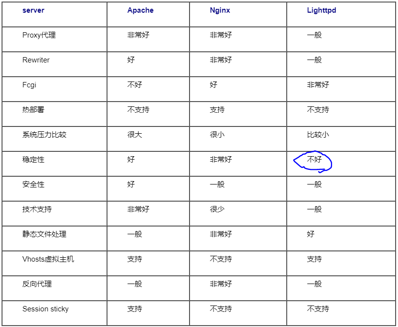

# middle-ware
为什么使用它们？
它们解决了什么问题？
它们有什么特点？
使用中出现了什么问题？

1.场景
2.是什么？
3.做什么？
4.怎么做到的？

http server

## elk根据日志级别触发警告
es插件watcher / elastAlert
ERROR/FATAL级别日志 触发钉钉/微信/邮件告警

DEBUG日志仅用于调试

INFO日志用于链路跟踪

### 钉钉告警

### 微信告警

### 短信告警

### 邮件告警
